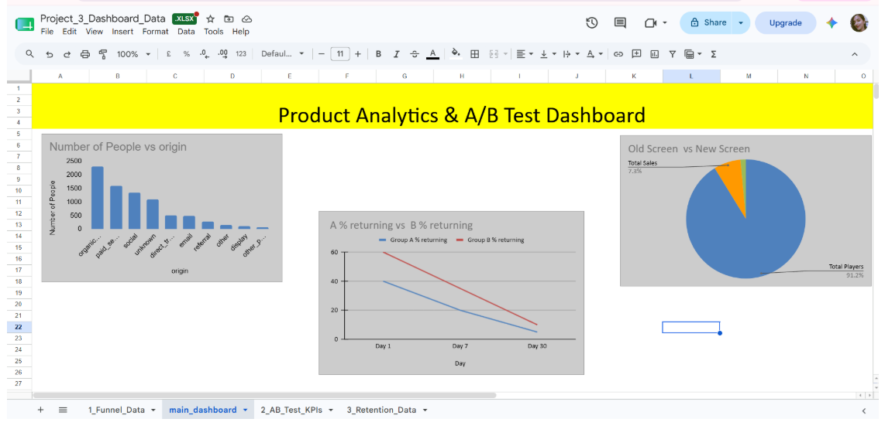

# 🛒 E-Commerce Marketing Funnel & A/B Testing Analysis

## 📌 Project Overview
This project analyzes the marketing funnel of Olist, a Brazilian e-commerce platform. The goal was to understand where users are coming from, evaluate the performance of a new checkout page through A/B testing, and track user retention over time. 

## 🎯 Business Problems Solved
1. **Traffic Analysis:** Identified the top marketing channels driving users to the store.
2. **Conversion Optimization:** Conducted an A/B test to determine if a new checkout screen design increases the sales conversion rate.
3. **Retention Tracking:** Analyzed the 30-day drop-off rate of users to measure long-term engagement.

## 🛠️ Tools & Technologies Used
* **Python:** Data manipulation and mathematical simulation (`pandas`, `numpy`)
* **Matplotlib:** Exploratory data visualization
* **Google Sheets:** Final executive dashboard creation

## 📊 Key Performance Indicators (KPIs) & Results
* **A/B Test Outcome:** The New Screen (Group B) outperformed the Old Screen (Group A).
* **Conversion Rates:** 
  * Group A (Old): [Type your % here]
  * Group B (New): [Type your % here]
* **Business Lift:** The new checkout page generated a positive lift, proving it is a statistically better design for the business.

## 📈 Executive Dashboard
Below is the final dashboard visualizing the marketing funnel, A/B test results, and retention curves.

*Note: The A/B test and retention data were simulated using Numpy's binomial distribution to represent a real-world testing environment.*
